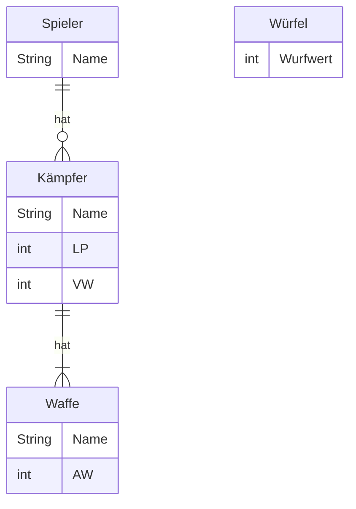

# Szenario

Es soll Schritt für Schritt ein kleines Strategiespiel für zwei Spieler entwickelt werden, bei dem beide Spieler abwechselnd einen der eigenen Kämpfer gegen einen Kämpfer des anderen Spielers angreifen lassen.

# Aufgabe 1 (Wiederholung Vorlesung 1 - 3)

Erstelle eine ausführbare Klasse wie folgt:
- es sollen Datenobjekte für alle relevanten Eigenschaften des abgebildeten ER-Modells für 2 Spieler, 2 Kämpfer, 2 Waffen und 10 Würfel deklariert werden
- es soll möglich sein, den deklarierten Datenobjekten für die relevanten Eigenschaften der Spieler, Kämpfer und Waffen über die Konsole Werte zuzuweisen
- es sollen zwei Angriffe simuliert werden

## Ablauf eines Angriffs und Ermittlung des Schadens

Der angreifende Spieler würfelt mit der Anzahl AW seiner Waffe, der verteidigende Spieler würfelt mit der Anzahl VW. Anschließend wird der Schaden berechnet und dem verteidigenden Spieler Lebenspunkte in Höhe des Schadens abgezogen. Der Schaden berechnet sich dabei aus Anzahl Treffer - Anzahl Blocks. Die Anzahl Treffer ergibt sich aus der Summe der Wurfwerte (1-6) des angreifenden Spielers, die Anzahl Blocks aus der Summe der Wurfwerte (1-6) des verteidigenden Spielers.

**Hinweise**

- Die Problematik, dass ein verteidigender Spieler bei einem Angriff "geheilt" wird (Anzahl Treffer < Anzahl Blocks), soll aktuell noch ignoriert werden
- Die Problematik, dass ein "toter" Spieler angreift (Schaden beim ersten Angriff > 10 LP), soll aktuell noch ignoriert werden

## ER-Modell



Legende: LP = Lepenspunkte, VW = Verteidigungswert, AW = Angriffswert

## Beispielhafte Konsolenausgabe

```console
Spieler 1, Name: Hans
Spieler 1, Kämpfer 1, Name: Gregor
Spieler 1, Kämpfer 1, LP: 10
Spieler 1, Kämpfer 1, VW: 3
Spieler 1, Kämpfer 1, Waffe 1, Name: Boltpistole
Spieler 1, Kämpfer 1, Waffe 1, AW: 4

Spieler 2, Name: Peter
Spieler 2, Kämpfer 1, Name: Bonekraka
Spieler 2, Kämpfer 1, LP: 10
Spieler 2, Kämpfer 1, VW: 3
Spieler 2, Kämpfer 1, Waffe 1, Name: Spalta
Spieler 2, Kämpfer 1, Waffe 1, AW: 4

Runde 1, Zug 1
Gregor: 10 LP, Bonekraka: 10 LP
Gregor greift Bonekraka mit Boltpistole an.
Gregor würfelt 2, 2, 3 und 6.
Gregor erzielt 13 Treffer.
Bonekraka würfelt 1, 4 und 5.
Bonekraka erzielt 10 Block.
Bonekraka erleidet 3 Schaden.

Runde 1, Zug 2
Gregor: 10 LP, Bonekraka: 7 LP
Bonekraka greift Gregor mit Spalta an.
Bonekraka würfelt 1, 1, 3 und 5.
Bonekraka erzielt 10 Treffer.
Gregor würfelt 2, 4 und 5.
Gregor erzielt 11 Block.
Gregor erleidet -1 Schaden.
```
