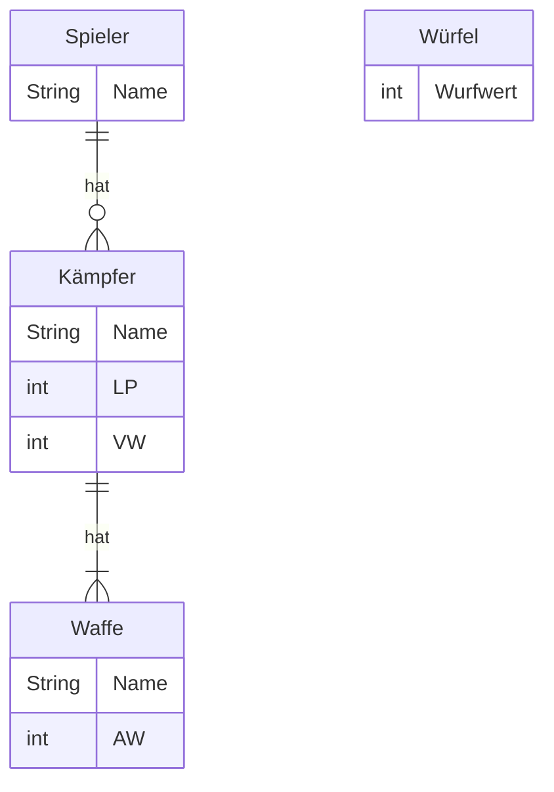
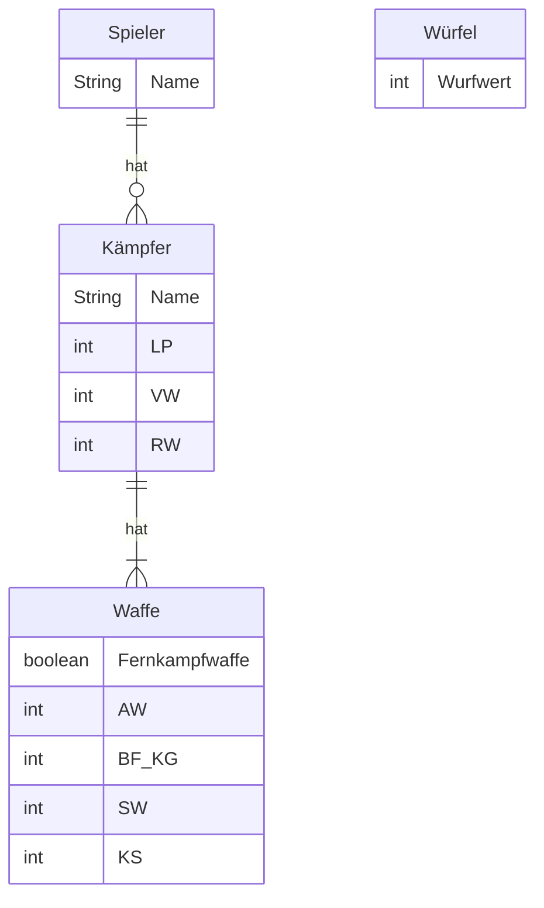

# Szenario

Es soll Schritt für Schritt ein kleines Strategiespiel für zwei Spieler entwickelt werden, bei dem beide Spieler abwechselnd einen der eigenen Kämpfer gegen einen Kämpfer des anderen Spielers angreifen lassen.

# Aufgabe 1 (Wiederholung Vorlesung 1 - 3)

Erstelle eine ausführbare Klasse wie folgt:
- es sollen Datenobjekte für alle Eigenschaften des abgebildeten ER-Modells für 2 Spieler, 2 Kämpfer, 2 Waffen und 10 Würfel deklariert werden
- es soll möglich sein, den Datenobjekten für die Eigenschaften der Spieler, Kämpfer und Waffen über die Konsole Werte zuzuweisen
- es sollen zwei Angriffe simuliert werden

## Ablauf eines Angriffs und Ermittlung des Schadens

Der angreifende Spieler würfelt mit der Anzahl AW seiner Waffe, der verteidigende Spieler würfelt mit der Anzahl VW. Anschließend wird der Schaden berechnet und dem verteidigenden Spieler Lebenspunkte in Höhe des Schadens abgezogen. Der Schaden berechnet sich dabei gemäß der Formel _Anzahl Treffer - Anzahl Blocks_. Die Anzahl Treffer ergibt sich aus der Summe der Wurfwerte des angreifenden Spielers, die Anzahl Blocks aus der Summe der Wurfwerte des verteidigenden Spielers.

**Hinweise**

- Wurfwerte sollen zwischen 1 und 6 liegen
- Die Problematiken, dass ein verteidigender Spieler bei einem Angriff "geheilt" wird (Anzahl Treffer < Anzahl Blocks) und dass ein "toter" Spieler angreift (Schaden beim ersten Angriff >= 10 LP), sollen aktuell noch ignoriert werden.

## ER-Modell



Legende: LP = Lebenspunkte, VW = Verteidigungswert, AW = Angriffswert

## Beispielhafte Konsolenausgabe

```console
Spieler 1, Name: Hans
Spieler 1, Kämpfer 1, Name: Gregor
Spieler 1, Kämpfer 1, LP: 10
Spieler 1, Kämpfer 1, VW: 3
Spieler 1, Kämpfer 1, Waffe 1, Name: Boltpistole
Spieler 1, Kämpfer 1, Waffe 1, AW: 4

Spieler 2, Name: Peter
Spieler 2, Kämpfer 1, Name: Bonekraka
Spieler 2, Kämpfer 1, LP: 10
Spieler 2, Kämpfer 1, VW: 3
Spieler 2, Kämpfer 1, Waffe 1, Name: Spalta
Spieler 2, Kämpfer 1, Waffe 1, AW: 4

*----------------*
* Runde 1, Zug 1 *
*----------------*
Gregor: 10 LP, Bonekraka: 10 LP

Gregor greift Bonekraka mit Boltpistole an.
Gregor würfelt 2, 2, 3 und 6.
Gregor erzielt 13 Treffer.
Bonekraka würfelt 1, 4 und 5.
Bonekraka erzielt 10 Blocks.
Bonekraka erleidet 3 Schaden und hat noch 7 LP.

*----------------*
* Runde 1, Zug 2 *
*----------------*
Gregor: 10 LP, Bonekraka: 7 LP

Bonekraka greift Gregor mit Spalta an.
Bonekraka würfelt 1, 1, 3 und 5.
Bonekraka erzielt 10 Treffer.
Gregor würfelt 2, 4 und 5.
Gregor erzielt 11 Blocks.
Gregor erleidet -1 Schaden und hat noch 11 LP.
```

# Aufgabe 2 (Wiederholung Vorlesung 4)

Passe die ausführbare Klasse wie folgt an:
- es sollen Datenobjekte für alle neuen Eigenschaften des abgebildeten ER-Modells für 2 Spieler, 6 Kämpfer, 6 Nahkampfwaffen, 6 Fernkampfwaffen und 10 Würfel deklariert werden
- es soll möglich sein, den neuen Datenobjekten über die Konsole Werte zuzuweisen (alternativ können den Datenobjekten auch statisch Werte zugewiesen werden)
- es soll ein vollständiges Spiel umgesetzt werden

## Spielablauf

Das Spiel soll aus mehreren Runden bestehen und solange dauern, bis ein Spieler keine Kämpfer mehr hat. In jeder Runde sollen sich die Kämpfer der Spieler gegenseitig abwechselnd angreifen können. Dabei sollen die Spieler in jeder Runde entscheiden können, in welcher Reihenfolge die Kämpfer angreifen und welcher eigene Kämpfer welchen gegnerischen Kämpfer angreifen soll. Zudem soll jeder Spieler entscheiden können, ob der eigene Kämpfer einen Fernkampfangriff oder einen Nahkampfangriff ausführen soll. "Stirbt" ein Kämpfer (LP <= 0), soll der Kämpfer für das restliche Spiel nicht mehr zur Verfügung stehen.

## Ablauf eines Fernkampangriffs und Ermittlung des Schadens

Der angreifende Spieler würfelt mit der Anzahl AW seiner Fernkampfwaffe, der verteidigende Spieler würfelt mit der Anzahl VW. Anschließend wird der Schaden berechnet und dem verteidigenden Spieler Lebenspunkte in Höhe des Schadens abgezogen. Der Schaden berechnet sich dabei gemäß der Formel _(Anzahl Treffer - Anzahl Blocks) x SW + (Anzahl Kritischer Treffer - Anzahl Kritischer Blocks) x KS_. Die Anzahl Treffer ergibt sich aus der Summe der Wurfwerte des angreifenden Spielers >= BF_KG, die Anzahl Blocks aus der Summe der Wurfwerte des verteidigenden Spielers >= RW.

**Hinweise**

- Wurfwerte sollen zwischen 1 und 6 liegen
- Wurfwerte gleich 6 sollen Kritische Treffer bzw. Kritische Blocks darstellen

## Ablauf eines Nahkampfangriffs und Ermittlung des Schadens

Beide Spieler würfeln mit der Anzahl AW ihrer Nahkampfwaffe. Anschließend soll jeder Spieler, beginnend beim angreifenden Spieler, abwechselnd entscheiden können, ob eine (Kritische) Attacke als (Kritischer) Schlag oder als (Kritische) Parade gelten soll. Die Anzahl Attacken ergibt sich aus der Summe der Wurfwerte (1-6) >= BF_KG. Bei einem (Kritischen) Schlag werdem dem gegnerischen Spieler Lebenspunkte in Höhe SW bzw. KS abgezogen, bei einer (Kritischen) Parade wird die Anzahl (Kritischer) Attacken des gegnerischen Spielers um 1 reduziert.

**Hinweise**

- Wurfwerte sollen zwischen 1 und 6 liegen
- Wurfwerte gleich 6 sollen Kritische Attacken darstellen

## ER-Modell



Legende: LP = Lepenspunkte, VW = Verteidigungswert, RW = Rüstungswurf, AW = Angriffswert, BF_KG = Ballistische Fertigkeit / Kampfgeschick, SW = Schadenswert, KS = Kritischer Schadenswert

## Beispielhafte Konsolenausgabe

```console
Spieler 1, Name: Hans
Spieler 1, Kämpfer 1, Name: Gregor
Spieler 1, Kämpfer 1, LP: 8
Spieler 1, Kämpfer 1, VW: 3
Spieler 1, Kämpfer 1, RW: 5
Spieler 1, Kämpfer 1, Waffe 1, Name: Boltpistole
Spieler 1, Kämpfer 1, Waffe 1, Fernkampfwaffe: true
Spieler 1, Kämpfer 1, Waffe 1, AW: 4
Spieler 1, Kämpfer 1, Waffe 1, BF_KG: 3
Spieler 1, Kämpfer 1, Waffe 1, SW: 2
Spieler 1, Kämpfer 1, Waffe 1, KS: 3
Spieler 1, Kämpfer 1, Waffe 2, Name: Energieschwert
Spieler 1, Kämpfer 1, Waffe 2, Fernkampfwaffe: false
Spieler 1, Kämpfer 1, Waffe 2, AW: 3
Spieler 1, Kämpfer 1, Waffe 2, BF_KG: 3
Spieler 1, Kämpfer 1, Waffe 2, SW: 3
Spieler 1, Kämpfer 1, Waffe 2, KS: 4
...

Spieler 2, Name: Peter
Spieler 2, Kämpfer 1, Name: Bonekraka
Spieler 2, Kämpfer 1, LP: 10
Spieler 2, Kämpfer 1, VW: 3
Spieler 2, Kämofer 1, RW: 5
Spieler 2, Kämpfer 1, Waffe 1, Name: Spalta
Spieler 2, Kämpfer 1, Waffe 1, Fernkampfwaffe: false
Spieler 2, Kämpfer 1, Waffe 1, AW: 4
Spieler 2, Kämpfer 1, Waffe 1, BF_KG: 4
Spieler 2, Kämpfer 1, Waffe 1, SW: 3
Spieler 2, Kämpfer 1, Waffe 1, KS: 4
...

*----------------*
* Runde 1, Zug 1 *
*----------------*
Kämpfer von Hans: Gregor (8 LP), Marcus (7 LP), Garviel (10 LP)
Kämpfer von Peter: Bonekraka (10 LP), Azrag (8 LP), Uruk (12 LP)

Hans gib bitte an, welcher Kämpfer angreifen soll: Gregor
Hans gib bitte an, welcher Kämpfer angegriffen werden soll: Bonekraka
Hans gib bitte an, ob ein Fernkampfangriff durchgeführt werden soll: true

Gregor greift Bonekraka mit Boltpistole an.
Gregor würfelt 2, 3, 4 und 6.
Gregor erzielt 2 Treffer und 1 Kritischer Treffer.
Bonekraka würfelt 1, 4 und 5.
Bonekraka erzielt 1 Blocks und 0 Kritischer Blocks.
Bonekraka erleidet 2 Schaden und 3 Kritischen Schaden und hat noch 5 LP.

*----------------*
* Runde 1, Zug 2 *
*----------------*
Kämpfer von Hans: Gregor (8 LP), Marcus (7 LP), Garviel (10 LP)
Kämpfer von Peter: Bonekraka (5 LP), Azrag (8 LP), Uruk (12 LP)

Peter gib bitte an, welcher Kämpfer angreifen soll: Bonekraka
Peter gib bitte an, welcher Kämpfer angegriffen werden soll: Gregor
Peter gib bitte an, ob ein Fernkampfangriff durchgeführt werden soll: false

Bonekraka greift Gregor mit Spalta an.
Bonekraka würfelt 1, 4, 4 und 6.
Bonekraka erzielt 2 Attacken und 1 Kritische Attacken.
Gregor würfelt 2, 4 und 5.
Gregor erzielt 2 Attacken und 0 Kritische Attacken.

Peter gib bitte an, ob Bonekraka Kritisch Schlagen (1), Schlagen (2), Kritisch Blocken (3) oder Blocken (4) soll: 1
Gregor erleidet 4 Kritischer Schaden und hat noch 4 LP.
Hans gib bitte an, ob Gregor kritisch Schlagen (1), Schlagen (2), Kritisch Blocken (3) oder Blocken (4) soll: 2
Bonekraka erleidet 3 Schaden und hat noch 2 LP.
Peter gib bitte an, ob Bonekraka kritisch Schlagen (1), Schlagen (2), Kritisch Blocken (3) oder Blocken (4) soll: 2
Gregor erleidet 3 Schaden und hat noch 1 LP.
Hans gib bitte an, ob Gregor kritisch Schlagen (1), Schlagen (2), Kritisch Blocken (3) oder Blocken (4) soll: 2
Bonekraka erleidet 3 Schaden und stirbt.
```
````

**Output:**
<!-- prettier-ignore -->
````markdown
# Szenario

Es soll Schritt für Schritt ein kleines Strategiespiel für zwei Spieler
entwickelt werden, bei dem beide Spieler abwechselnd einen der eigenen Kämpfer
gegen einen Kämpfer des anderen Spielers angreifen lassen.

# Aufgabe 1 (Wiederholung Vorlesung 1 - 3)

Erstelle eine ausführbare Klasse wie folgt:

- es sollen Datenobjekte für alle Eigenschaften des abgebildeten ER-Modells für
  2 Spieler, 2 Kämpfer, 2 Waffen und 10 Würfel deklariert werden
- es soll möglich sein, den Datenobjekten für die Eigenschaften der Spieler,
  Kämpfer und Waffen über die Konsole Werte zuzuweisen
- es sollen zwei Angriffe simuliert werden

## Ablauf eines Angriffs und Ermittlung des Schadens

Der angreifende Spieler würfelt mit der Anzahl AW seiner Waffe, der
verteidigende Spieler würfelt mit der Anzahl VW. Anschließend wird der Schaden
berechnet und dem verteidigenden Spieler Lebenspunkte in Höhe des Schadens
abgezogen. Der Schaden berechnet sich dabei gemäß der Formel _Anzahl Treffer -
Anzahl Blocks_. Die Anzahl Treffer ergibt sich aus der Summe der Wurfwerte des
angreifenden Spielers, die Anzahl Blocks aus der Summe der Wurfwerte des
verteidigenden Spielers.

**Hinweise**

- Wurfwerte sollen zwischen 1 und 6 liegen
- Die Problematiken, dass ein verteidigender Spieler bei einem Angriff "geheilt"
  wird (Anzahl Treffer < Anzahl Blocks) und dass ein "toter" Spieler angreift
  (Schaden beim ersten Angriff >= 10 LP), sollen aktuell noch ignoriert werden.

## ER-Modell


Legende: LP = Lebenspunkte, VW = Verteidigungswert, AW = Angriffswert

## Beispielhafte Konsolenausgabe

```console
Spieler 1, Name: Hans
Spieler 1, Kämpfer 1, Name: Gregor
Spieler 1, Kämpfer 1, LP: 10
Spieler 1, Kämpfer 1, VW: 3
Spieler 1, Kämpfer 1, Waffe 1, Name: Boltpistole
Spieler 1, Kämpfer 1, Waffe 1, AW: 4

Spieler 2, Name: Peter
Spieler 2, Kämpfer 1, Name: Bonekraka
Spieler 2, Kämpfer 1, LP: 10
Spieler 2, Kämpfer 1, VW: 3
Spieler 2, Kämpfer 1, Waffe 1, Name: Spalta
Spieler 2, Kämpfer 1, Waffe 1, AW: 4

*----------------*
* Runde 1, Zug 1 *
*----------------*
Gregor: 10 LP, Bonekraka: 10 LP

Gregor greift Bonekraka mit Boltpistole an.
Gregor würfelt 2, 2, 3 und 6.
Gregor erzielt 13 Treffer.
Bonekraka würfelt 1, 4 und 5.
Bonekraka erzielt 10 Blocks.
Bonekraka erleidet 3 Schaden und hat noch 7 LP.

*----------------*
* Runde 1, Zug 2 *
*----------------*
Gregor: 10 LP, Bonekraka: 7 LP

Bonekraka greift Gregor mit Spalta an.
Bonekraka würfelt 1, 1, 3 und 5.
Bonekraka erzielt 10 Treffer.
Gregor würfelt 2, 4 und 5.
Gregor erzielt 11 Blocks.
Gregor erleidet -1 Schaden und hat noch 11 LP.
```

# Aufgabe 2 (Wiederholung Vorlesung 4)

Passe die ausführbare Klasse wie folgt an:

- es sollen Datenobjekte für alle neuen Eigenschaften des abgebildeten
  ER-Modells für 2 Spieler, 6 Kämpfer, 6 Nahkampfwaffen, 6 Fernkampfwaffen und
  10 Würfel deklariert werden
- es soll möglich sein, den neuen Datenobjekten über die Konsole Werte
  zuzuweisen (alternativ können den Datenobjekten auch statisch Werte zugewiesen
  werden)
- es soll ein vollständiges Spiel umgesetzt werden

## Spielablauf

Das Spiel soll aus mehreren Runden bestehen und solange dauern, bis ein Spieler
keine Kämpfer mehr hat. In jeder Runde sollen sich die Kämpfer der Spieler
gegenseitig abwechselnd angreifen können. Dabei sollen die Spieler in jeder
Runde entscheiden können, in welcher Reihenfolge die Kämpfer angreifen und
welcher eigene Kämpfer welchen gegnerischen Kämpfer angreifen soll. Zudem soll
jeder Spieler entscheiden können, ob der eigene Kämpfer einen Fernkampfangriff
oder einen Nahkampfangriff ausführen soll. "Stirbt" ein Kämpfer (LP <= 0), soll
der Kämpfer für das restliche Spiel nicht mehr zur Verfügung stehen.

## Ablauf eines Fernkampangriffs und Ermittlung des Schadens

Der angreifende Spieler würfelt mit der Anzahl AW seiner Fernkampfwaffe, der
verteidigende Spieler würfelt mit der Anzahl VW. Anschließend wird der Schaden
berechnet und dem verteidigenden Spieler Lebenspunkte in Höhe des Schadens
abgezogen. Der Schaden berechnet sich dabei gemäß der Formel _(Anzahl Treffer -
Anzahl Blocks) x SW + (Anzahl Kritischer Treffer - Anzahl Kritischer Blocks) x
KS_. Die Anzahl Treffer ergibt sich aus der Summe der Wurfwerte des angreifenden
Spielers >= BF_KG, die Anzahl Blocks aus der Summe der Wurfwerte des
verteidigenden Spielers >= RW.

**Hinweise**

- Wurfwerte sollen zwischen 1 und 6 liegen
- Wurfwerte gleich 6 sollen Kritische Treffer bzw. Kritische Blocks darstellen

## Ablauf eines Nahkampfangriffs und Ermittlung des Schadens

Beide Spieler würfeln mit der Anzahl AW ihrer Nahkampfwaffe. Anschließend soll
jeder Spieler, beginnend beim angreifenden Spieler, abwechselnd entscheiden
können, ob eine (Kritische) Attacke als (Kritischer) Schlag oder als (Kritische)
Parade gelten soll. Die Anzahl Attacken ergibt sich aus der Summe der Wurfwerte
(1-6) >= BF_KG. Bei einem (Kritischen) Schlag werdem dem gegnerischen Spieler
Lebenspunkte in Höhe SW bzw. KS abgezogen, bei einer (Kritischen) Parade wird
die Anzahl (Kritischer) Attacken des gegnerischen Spielers um 1 reduziert.

**Hinweise**

- Wurfwerte sollen zwischen 1 und 6 liegen
- Wurfwerte gleich 6 sollen Kritische Attacken darstellen

## ER-Modell


Legende: LP = Lepenspunkte, VW = Verteidigungswert, RW = Rüstungswurf, AW =
Angriffswert, BF_KG = Ballistische Fertigkeit / Kampfgeschick, SW =
Schadenswert, KS = Kritischer Schadenswert

## Beispielhafte Konsolenausgabe

```console
Spieler 1, Name: Hans
Spieler 1, Kämpfer 1, Name: Gregor
Spieler 1, Kämpfer 1, LP: 8
Spieler 1, Kämpfer 1, VW: 3
Spieler 1, Kämpfer 1, RW: 5
Spieler 1, Kämpfer 1, Waffe 1, Name: Boltpistole
Spieler 1, Kämpfer 1, Waffe 1, Fernkampfwaffe: true
Spieler 1, Kämpfer 1, Waffe 1, AW: 4
Spieler 1, Kämpfer 1, Waffe 1, BF_KG: 3
Spieler 1, Kämpfer 1, Waffe 1, SW: 2
Spieler 1, Kämpfer 1, Waffe 1, KS: 3
Spieler 1, Kämpfer 1, Waffe 2, Name: Energieschwert
Spieler 1, Kämpfer 1, Waffe 2, Fernkampfwaffe: false
Spieler 1, Kämpfer 1, Waffe 2, AW: 3
Spieler 1, Kämpfer 1, Waffe 2, BF_KG: 3
Spieler 1, Kämpfer 1, Waffe 2, SW: 3
Spieler 1, Kämpfer 1, Waffe 2, KS: 4
...

Spieler 2, Name: Peter
Spieler 2, Kämpfer 1, Name: Bonekraka
Spieler 2, Kämpfer 1, LP: 10
Spieler 2, Kämpfer 1, VW: 3
Spieler 2, Kämofer 1, RW: 5
Spieler 2, Kämpfer 1, Waffe 1, Name: Spalta
Spieler 2, Kämpfer 1, Waffe 1, Fernkampfwaffe: false
Spieler 2, Kämpfer 1, Waffe 1, AW: 4
Spieler 2, Kämpfer 1, Waffe 1, BF_KG: 4
Spieler 2, Kämpfer 1, Waffe 1, SW: 3
Spieler 2, Kämpfer 1, Waffe 1, KS: 4
...

*----------------*
* Runde 1, Zug 1 *
*----------------*
Kämpfer von Hans: Gregor (8 LP), Marcus (7 LP), Garviel (10 LP)
Kämpfer von Peter: Bonekraka (10 LP), Azrag (8 LP), Uruk (12 LP)

Hans gib bitte an, welcher Kämpfer angreifen soll: Gregor
Hans gib bitte an, welcher Kämpfer angegriffen werden soll: Bonekraka
Hans gib bitte an, ob ein Fernkampfangriff durchgeführt werden soll: true

Gregor greift Bonekraka mit Boltpistole an.
Gregor würfelt 2, 3, 4 und 6.
Gregor erzielt 2 Treffer und 1 Kritischer Treffer.
Bonekraka würfelt 1, 4 und 5.
Bonekraka erzielt 1 Blocks und 0 Kritischer Blocks.
Bonekraka erleidet 2 Schaden und 3 Kritischen Schaden und hat noch 5 LP.

*----------------*
* Runde 1, Zug 2 *
*----------------*
Kämpfer von Hans: Gregor (8 LP), Marcus (7 LP), Garviel (10 LP)
Kämpfer von Peter: Bonekraka (5 LP), Azrag (8 LP), Uruk (12 LP)

Peter gib bitte an, welcher Kämpfer angreifen soll: Bonekraka
Peter gib bitte an, welcher Kämpfer angegriffen werden soll: Gregor
Peter gib bitte an, ob ein Fernkampfangriff durchgeführt werden soll: false

Bonekraka greift Gregor mit Spalta an.
Bonekraka würfelt 1, 4, 4 und 6.
Bonekraka erzielt 2 Attacken und 1 Kritische Attacken.
Gregor würfelt 2, 4 und 5.
Gregor erzielt 2 Attacken und 0 Kritische Attacken.

Peter gib bitte an, ob Bonekraka Kritisch Schlagen (1), Schlagen (2), Kritisch Blocken (3) oder Blocken (4) soll: 1
Gregor erleidet 4 Kritischer Schaden und hat noch 4 LP.
Hans gib bitte an, ob Gregor kritisch Schlagen (1), Schlagen (2), Kritisch Blocken (3) oder Blocken (4) soll: 2
Bonekraka erleidet 3 Schaden und hat noch 2 LP.
Peter gib bitte an, ob Bonekraka kritisch Schlagen (1), Schlagen (2), Kritisch Blocken (3) oder Blocken (4) soll: 2
Gregor erleidet 3 Schaden und hat noch 1 LP.
Hans gib bitte an, ob Gregor kritisch Schlagen (1), Schlagen (2), Kritisch Blocken (3) oder Blocken (4) soll: 2
Bonekraka erleidet 3 Schaden und stirbt.
```